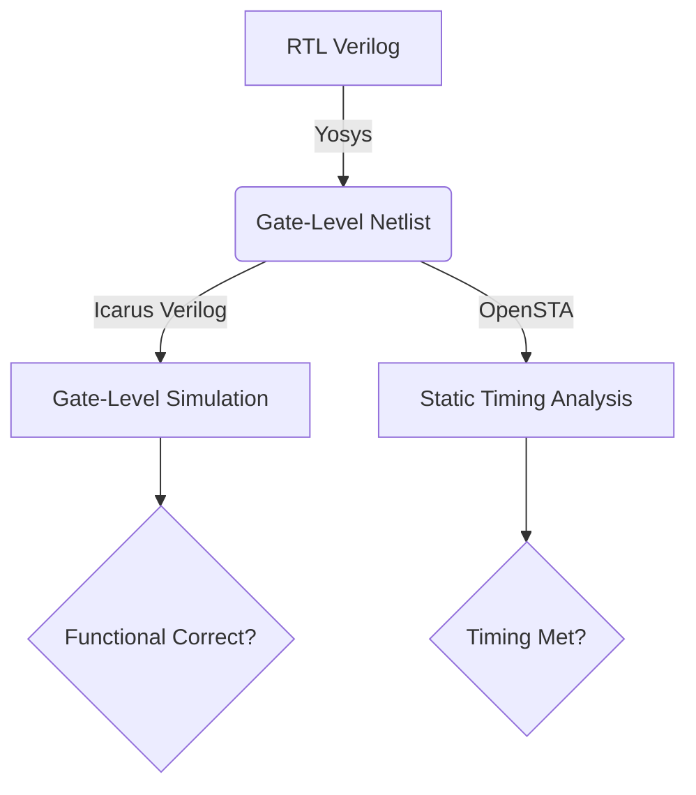
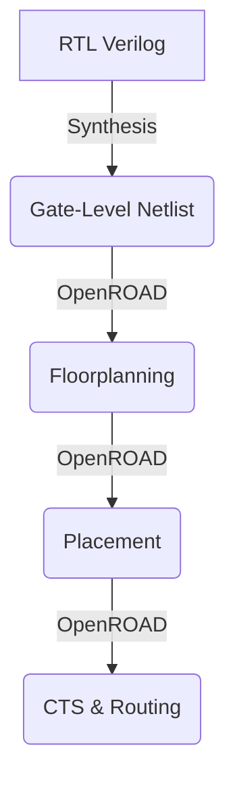

# 🖥️ VSDBabySoC: RISC-V SoC Design & Tapeout Journey

**Author:** Paidipilli Purushotham

**Program:** VSD RISC-V SoC Tapeout Program

**Technology:** SkyWater 130nm (Sky130)

**Current Status:** ✅ **Complete** (RTL to GDSII Flow Executed & Verified)

---

## 📋 Table of Contents

**Executive Summary**

  * [The Vision: VSDBabySoC Architecture](https://www.google.com/search?q=%23-the-vision-vsdbabysoc-architecture)

**Part 1: The Foundation (Skill Building)**

  * [Day 1: Simulation Flow & Tool Setup](https://www.google.com/search?q=%23-day-1-simulation-flow--tool-setup)
  * [Day 2: Timing Libraries & Hierarchical Synthesis](https://www.google.com/search?q=%23-day-2-timing-libraries--hierarchical-synthesis)
  * [Day 3: Optimization Techniques](https://www.google.com/search?q=%23-day-3-optimization-techniques)
  * [Day 4: GLS & Synthesis Mismatches](https://www.google.com/search?q=%23-day-4-gls--synthesis-mismatches)
  * [Day 5: Advanced Verilog Strategies](https://www.google.com/search?q=%23-day-5-advanced-verilog-strategies)

**Part 2: VSDBabySoC Implementation (The Project)**

  * [Step 1: Architecture & Workspace Setup](https://www.google.com/search?q=%23-step-1-architecture--workspace-setup)
  * [Step 2: TL-Verilog to Verilog Conversion](https://www.google.com/search?q=%23-step-2-tl-verilog-to-verilog-conversion)
  * [Step 3: Pre-Synthesis Simulation](https://www.google.com/search?q=%23-step-3-pre-synthesis-simulation)
  * [Step 4: SoC Synthesis with Analog IP](https://www.google.com/search?q=%23-step-4-soc-synthesis-with-analog-ip)
  * [Step 5: Post-Synthesis Verification](https://www.google.com/search?q=%23-step-5-post-synthesis-verification)

**Part 3: Post-Synthesis Verification & Timing Analysis**

  * [Step 1: Synthesis (RTL to Netlist)](https://www.google.com/search?q=%23-phase-1-synthesis-rtl-to-netlist)
  * [Step 2: Post-Synthesis Simulation (GLS)](https://www.google.com/search?q=%23-phase-2-post-synthesis-simulation-gls)
  * [Step 3: Static Timing Analysis (STA) with OpenSTA](https://www.google.com/search?q=%23-performing-sta-on-vsdbabysoc)
  * [Step 4: Visualizing Timing Results](https://www.google.com/search?q=%23-visualizing-timing-graphs)

**Part 4: Circuit Characterization & SPICE Simulations**

  * [Day 1: nMOSFET I-V Characteristics](https://www.google.com/search?q=%23-day-1-nmosfet-i-v-characteristics)
  * [Day 2: Velocity Saturation & Short-Channel Effects](https://www.google.com/search?q=%23-day-2-velocity-saturation--short-channel-effects)
  * [Day 3: CMOS Switching Threshold](https://www.google.com/search?q=%23-day-3-cmos-switching-threshold-vm)
  * [Day 4: Noise Margins & Robustness](https://www.google.com/search?q=%23-day-4-noise-margins--robustness)
  * [Day 5: Power Supply & Process Variation](https://www.google.com/search?q=%23-day-5-power-supply--process-variation)

**Part 5: Physical Design - OpenROAD Flow**

  * [Step 1: Installation & Setup](https://www.google.com/search?q=%23-step-1-installation--setup)
  * [Step 2: Running the Flow (RTL to Placement)](https://www.google.com/search?q=%23-step-2-running-the-flow-rtl-to-placement)
  * [Step 3: Visualizing the Layout (GUI & KLayout)](https://www.google.com/search?q=%23-step-3-visualizing-the-layout)

**Part 6: Advanced Physical Design & Timing Closure**

  * [Step 1: Floorplanning & Power Planning](https://www.google.com/search?q=%23-step-1-floorplanning--power-planning)
  * [Step 2: Placement & Custom Cell Integration](https://www.google.com/search?q=%23-step-2-placement--custom-cell-integration)
  * [Step 3: Timing Analysis & ECO (Pre-CTS)](https://www.google.com/search?q=%23-step-3-timing-analysis--eco-pre-cts)
  * [Step 4: Clock Tree Synthesis (CTS)](https://www.google.com/search?q=%23-step-4-clock-tree-synthesis-cts)

**Part 7: Final Physical Design & Tapeout Sign-off**

  * [Step 1: Environment Setup & Design Config](https://www.google.com/search?q=%23-step-1-environment-setup--design-configuration)
  * [Step 2: Synthesis & Floorplanning](https://www.google.com/search?q=%23-step-2-synthesis--floorplanning)
  * [Step 3: Placement & Congestion Management](https://www.google.com/search?q=%23-step-3-placement--congestion-management)
  * [Step 4: Clock Tree Synthesis (CTS)](https://www.google.com/search?q=%23-step-4-clock-tree-synthesis-cts)
  * [Step 5: Pre-Route Checks](https://www.google.com/search?q=%23-step-5-pre-route-checks-critical)
  * [Step 6: Final Routing & Extraction](https://www.google.com/search?q=%23-step-6-final-routing--extraction)
## 1️⃣ 🎯 Executive Summary

This repository documents the comprehensive journey of designing **VSDBabySoC**, a mixed-signal RISC-V System-on-Chip. The project leverages the **Open-Source ASIC Flow**, taking the design from Register Transfer Level (RTL) logic all the way to a layout ready for fabrication.

### 🏆 VSDBabySoC Architecture 

The SoC integrates three core components:

1.  **`rvmyth` (Digital):** A RISC-V CPU Core that executes instructions and outputs 10-bit data.
2.  **`avsdpll` (Analog):** A Phase-Locked Loop that generates a stable clock for the core.
3.  **`avsddac` (Analog):** A Digital-to-Analog Converter that takes the CPU output and converts it to an analog voltage.

-----

## 🎬 Part 1: The Foundation (Skill Building)

**Focus:** Mastering the open-source toolchain (iVerilog, GTKWave, Yosys) and understanding digital design nuances before tackling the full SoC.

### 🛠️ Day 1: Simulation Flow & Tool Setup
**Goal:** Establish the simulation environment.
We verified the flow using a **2:1 Multiplexer**.

1.  **Design & Testbench:** Created Verilog source.
2.  **Simulation:** Used `iverilog` to generate VCD.
3.  **Visualization:** Used `GTKWave` to inspect signals.

**Simulator, Design & Testbench Basics:**

**Icarus Verilog Flow:**


**Lab Output: 2:1 Multiplexer Waveform**


**Synthesis Result:**
We converted the RTL to a gate-level netlist using Yosys.


-----

### ⚙️ Day 2: Timing Libraries & Synthesis 

**Goal:** Mapping abstract HDL to physical Sky130 cells.
We analyzed `sky130_fd_sc_hd__tt_025C_1v80.lib` to understand PVT corners (Process, Voltage, Temperature) and compared **Hierarchical vs. Flattened** synthesis strategies.

-----

### ⚡ Day 3: Optimization Techniques {https://www.google.com/search?q=%23-day-3-optimization-techniques}

**Goal:** Reducing Area and Power.
We applied **Constant Propagation** (removing logic for constant inputs) and **State Optimization** to simplify logic gates.

**Lab: Optimization Check (Ternary Operator Mux)**

  * **RTL Code:**
    
  * **Synthesis Output:**
    
  * **GLS Verification:**
    

-----

### 🔬 Day 4: GLS & Synthesis Mismatches 
**Goal:** Detecting "Simulation-Synthesis Mismatches."
We demonstrated that bad coding (e.g., missing sensitivity lists or improper blocking assignments) leads to functional errors that only appear in **Gate-Level Simulation (GLS)**.

**1. The "Bad MUX" Experiment:**

  * **Code (Missing Sensitivity List):**
   
  * **Synthesis (Latch Inferred):**
   
  * **GLS Mismatch Result:**
    

**2. Blocking Assignment Caveat:**

  * **Synthesis:**
   
  * **GLS Result:**
    

-----

### 🏗️ Day 5: Advanced Verilog Strategies {https://www.google.com/search?q=%23-day-5-advanced-verilog-strategies}

**Goal:** Scalable Design and Avoiding Latches.

**1. Latch Prevention (If/Else & Case):**

  * **Incomplete If (Latch Inferred):**
    
  * **Synthesis Result:**
    
  * **Bad Case Statement (Wildcard issues):**
    

**2. Scalable Design (Generate Blocks):**
We utilized `generate` blocks and `for` loops to create an **8-bit Ripple Carry Adder (RCA)** efficiently.

  * **Demux using For Loop:**
   
  * **8-bit RCA Code:**
    
  * **RCA Schematic:**
    

-----

## 🚀 Part 2: VSDBabySoC Implementation (The Project)

**Focus:** Applying the skills from Part 1 to build, simulate, and synthesize the complete mixed-signal SoC.

### 🧱 Step 1: Architecture & Workspace Setup {https://www.google.com/search?q=%23-step-1-architecture--workspace-setup}

The VSDBabySoC connects the digital world (RISC-V) with the analog world (DAC/PLL).

**Connections:**

  * `PLL` → provides `CLK` → `rvmyth` (CPU)
  * `rvmyth` → outputs `DATA` → `DAC`
  * `DAC` → outputs `Analog Voltage`

**File Structure:**

```bash
VSDBabySoC/
├── src/module/
│   ├── rvmyth.tlv       # RISC-V Core (TL-Verilog)
│   ├── avsdpll.v        # Analog PLL Model
│   ├── avsddac.v        # Analog DAC Model
│   └── vsdbabysoc.v     # Top-level integration
```

### ⚙️ Step 2: TL-Verilog to Verilog Conversion {https://www.google.com/search?q=%23-step-2-tl-verilog-to-verilog-conversion}

The CPU core (`rvmyth`) is designed in **TL-Verilog** for efficiency. We use **SandPiper-SaaS** to convert it to standard Verilog for synthesis.

```bash
# Activate SandPiper Environment
source sp_env/bin/activate

# Convert TLV to Verilog
sandpiper-saas -i ./src/module/*.tlv -o rvmyth.v --bestsv --noline -p verilog --outdir ./src/module/
```

✅ **Outcome:** `rvmyth.v` is generated and ready for synthesis.

### 🧪 Step 3: Pre-Synthesis Simulation {https://www.google.com/search?q=%23-step-3-pre-synthesis-simulation}

We verify the RTL functionality using `iverilog`. This simulation checks if the CPU is correctly driving the DAC inputs.

**Waveform Analysis:**
To see the DAC output correctly in GTKWave, we formatted the `OUT` signal as **Analog (Step)**.


**GTKWave Configuration:**
Changing the data format to view analog steps.


**Key Signals:**

  * `CLK`/`Reset`: Inputs from PLL/External.
  * `D[9:0]`: Digital output from the RISC-V core.
  * `OUT`: The simulated analog voltage stepping up/down based on CPU data.

### 🧰 Step 4: SoC Synthesis with Analog IP {https://www.google.com/search?q=%23-step-4-soc-synthesis-with-analog-ip}

We synthesized the design using **Yosys**.

  * **Challenge:** The PLL and DAC are *analog* blocks, so they don't have standard logic gates.
  * **Solution:** We mapped them as "Black Boxes" using their Liberty (`.lib`) files (`avsddac.lib`, `avsdpll.lib`), while the digital core was mapped to `sky130_fd_sc_hd`.

**Synthesized Schematic:**


**Yosys Output Log:**


### 🧪 Step 5: Post-Synthesis Verification {https://www.google.com/search?q=%23-step-5-post-synthesis-verification}

We ran a Gate-Level Simulation (GLS) on the synthesized netlist `vsdbabysoc.synth.v`.

**Why this matters:**
This simulation includes the actual standard cells (AND, OR, DFF) instead of behavioral logic. It validates that the synthesis tool correctly translated the logic and that the design functions with gate delays.


**Observation:**
The waveform shows numerous internal `wire` signals (e.g., `wire 3674`), confirming we are simulating the physical gate structure. The logic matches the pre-synthesis run, confirming a successful synthesis.

-----

### 🏁 Phase 2 Summary

✅ **Integrated:** Digital RISC-V Core with Analog PLL & DAC.
✅ **Converted:** TL-Verilog to Standard Verilog using SandPiper.
✅ **Synthesized:** Full SoC using Analog Black-Box Libraries.
✅ **Verified:** Validated functionality via Pre-Synth and Post-Synth simulations.

**🚀 Next Up:** Phase 3 - Physical Design (Floorplanning & Placement)

## 🔎 Part 3: Post-Synthesis Verification & Timing Analysis

**Focus:** Transforming the RTL into a Gate-Level Netlist, verifying it via Gate-Level Simulation (GLS), and performing Static Timing Analysis (STA) to ensure the design meets timing constraints across all Process-Voltage-Temperature (PVT) corners.

### 🌊 Workflow Overview

The flow moves from abstract behavior to concrete silicon logic:

1.  **Synthesis (Yosys):** RTL $\rightarrow$ Logic Gates (Netlist).
2.  **GLS (Icarus):** Netlist Verification.
3.  **STA (OpenSTA):** Timing Verification.

<!-- end list -->



### 🔬 Step 1: Synthesis (RTL to Netlist) {\#-phase-1-synthesis-rtl-to-netlist}

We used **Yosys** to translate the VSDBabySoC RTL into a netlist using the Sky130 PDK.

**1. Loading Design & Libraries:**
We read the Verilog modules (`vsdbabysoc.v`, `rvmyth.v`, `clk_gate.v`) and the Liberty files. Note that we used separate `.lib` files for the Analog IPs (`avsddac`, `avsdpll`) to treat them as black boxes.

*Loading Design Files:*


*Loading Liberty Files:*

**2. Synthesis & Mapping:**
We ran `synth -top vsdbabysoc` to generate generic logic, followed by `dfflibmap` to map Flip-Flops to Sky130 cells.


*Mapping D-Flip-Flops:*


**3. Optimization & Output:**
Using `opt` and `abc`, we optimized the design for the target library. Finally, we wrote the netlist `vsdbabysoc.synth.v`.

*Optimization & Tech Mapping:*

*Cleaning & Renaming:*


*Final Statistics & Write:*


-----

### ⚡ Step 2: Post-Synthesis Simulation (GLS) {\#-phase-2-post-synthesis-simulation-gls}

We compiled the **Synthesized Netlist** along with the **Sky130 Primitives** (`primitives.v`, `sky130_fd_sc_hd.v`) to verify that the gate-level translation functions correctly.

**Compilation Command:**
We used the `-DPOST_SYNTH_SIM` flag to switch the testbench to the netlist.

**Verification Result:**
The GLS waveforms matched the Pre-Synthesis RTL simulation, confirming the synthesis was successful.


-----

### 🛰️ Step 3: Static Timing Analysis (STA) with OpenSTA {\#-performing-sta-on-vsdbabysoc}

GLS verifies function, but STA verifies **Speed**. We used **OpenSTA** to analyze timing paths across multiple PVT corners.

**1. Setup & Installation:**
We built OpenSTA from source and set up the Sky130 Timing libraries.


**2. Multi-Corner Analysis Script:**
We wrote a TCL script (`run_sta.tcl`) to iterate through **13 different PVT libraries** (Typical, Fast, Slow corners at various temperatures).

**3. Execution:**
The STA run generated detailed reports for WNS (Worst Negative Slack) and TNS (Total Negative Slack).


**4. Data Parsing:**
We used a shell script to consolidate the logs into a summary table.


-----

### 📊 Step 4: Visualizing Timing Results {\#-visualizing-timing-graphs}

Using Python (`matplotlib`), we plotted the timing metrics across all corners to visualize margins.

**Composite Timing Graph:**
This plot summarizes Setup, Hold, WNS, and TNS across all analyzed corners.


**Detailed Metrics:**

  * **Worst Setup Slack:** (Positive slack = Timing Met)
    
  * **Worst Hold Slack:**
    
  * **Worst Negative Slack (WNS):**
   

-----

### 🏁 Part 3 Summary

✅ **Synthesized:** RTL converted to Sky130 Netlist.
✅ **Verified:** GLS matches Functional Simulation.
✅ **Analyzed:** Timing checked across 13 PVT corners.
✅ **Visualized:** Timing margins plotted successfully.

**🚀 Next Up:** Phase 3 - Physical Design (Floorplanning & Placement)

## 🔬 Part 4: Circuit Characterization & SPICE Simulations (Week 4)

**Focus:** Moving from digital abstraction to analog reality. We characterized the Sky130 MOSFETs using SPICE simulations to understand the physics governing timing, power, and robustness.

### 📜 Day 1: nMOSFET I-V Characteristics

**Goal:** Characterize the fundamental Current-Voltage behavior of the Sky130 nMOS device.

We simulated the device to observe the **Linear** (Resistive) and **Saturation** regions. Understanding these regions is critical because the saturation current ($I_{dsat}$) determines the "Drive Strength" of the cell—directly impacting circuit speed.

**Simulation Setup:**
We swept the Drain Voltage ($V_{ds}$) while stepping the Gate Voltage ($V_{gs}$).

**Result: Family of Curves**
The plot clearly shows the transition from the linear region to saturation (flattening of the curve).


**Derivation of Current Equation:**
We validated the square-law equations against the simulation.


-----

### ⚡ Day 2: Velocity Saturation & Short-Channel Effects

**Goal:** Compare "Long Channel" vs. "Short Channel" behavior.

In modern nodes like 130nm, the classic square-law ($I_d \propto V_{gs}^2$) breaks down due to **Velocity Saturation**. High electric fields cause carrier velocity to cap out, making the current linear with respect to $V_{gs}$.

**Simulation Results:**
We observed that for short-channel devices, the current increases linearly rather than quadratically at high $V_{gs}$.

**CMOS Inverter Theory:**
We began analyzing the Voltage Transfer Characteristic (VTC) by overlaying the NMOS and PMOS load curves.


-----

### ⚙️ Day 3: CMOS Switching Threshold ($V_m$)

**Goal:** Analyze the Switching Threshold—the point where $V_{in} = V_{out}$.

The switching threshold $V_m$ is determined by the ratio of the PMOS to NMOS drive strengths. An ideal inverter has $V_m = V_{dd}/2$.

**Sizing Impact:**
We found that a $W_p / W_n$ ratio of roughly **2:1 to 2.5:1** is required to center the VTC, as the PMOS hole mobility is lower than NMOS electron mobility.

**Static Analysis (VTC):**


**Dynamic Analysis (Transient Response):**
We simulated a pulse input to measure Rise and Fall delays.


-----

### 🔊 Day 4: Noise Margins & Robustness

**Goal:** Quantify the inverter's tolerance to noise.

We extracted the critical voltage points ($V_{IL}, V_{IH}, V_{OL}, V_{OH}$) from the VTC to calculate:

  * **$NM_L$ (Low Noise Margin):** $V_{IL} - V_{OL}$
  * **$NM_H$ (High Noise Margin):** $V_{OH} - V_{IH}$

**VTC for Extraction:**


-----

### 🔋 Day 5: Power Supply & Process Variation

**Goal:** Ensure the circuit works under non-ideal conditions.

**1. Power Supply Variation:**
We swept $V_{dd}$ from 1.8V down to lower voltages.

  * **Observation:** Lower Vdd saves energy but degrades noise margins and increases delay.


**2. Device Variation:**
We simulated "Strong PMOS / Weak NMOS" corners. The CMOS inverter proved remarkably robust—the switching threshold shifted, but the logic gate did not fail.

-----

### 🏁 Part 4 Summary

✅ **Characterized:** Sky130 NMOS I-V curves.
✅ **Analyzed:** Velocity Saturation effects in short-channel devices.
✅ **Optimized:** CMOS Inverter sizing for symmetric Switching Threshold ($V_m$).
✅ **Calculated:** Noise Margins ($NM_H, NM_L$).
✅ **Verified:** Robustness against Supply and Process variations.

## 🚀 Part 5: Physical Design - OpenROAD Flow (Week 5)

**Focus:** Setting up the complete **RTL-to-GDSII flow** using OpenROAD. We moved from specific circuit characterization to the macroscopic physical design process, taking a design from Verilog RTL to the Placement stage.

### 🌊 The Physical Design Journey

We utilized the **OpenROAD Flow Scripts** to automate the backend flow. This transforms the abstract RTL into physical geometry.



### ⚙️ Step 1: Installation & Setup

Setting up the environment involves compiling OpenROAD and its dependencies.

**1. Clone & Install:**
We cloned `OpenROAD-flow-scripts` and utilized the robust dependency installer to handle system-level packages.

```bash
sudo ./etc/DependencyInstaller.sh -all
./build_openroad.sh --local
```

**2. Troubleshooting:**
We encountered issues with missing libraries (`GTest`, `spdlog`).

  * **Solution:** The `-all` flag in the dependency installer was critical to ensure all local libraries (Eigen, Boost, etc.) were built correctly in the local environment.

**Successful Build:**


-----

### 🏃‍♂️ Step 2: Running the Flow (RTL to Placement)

We verified the toolchain using the `gcd` (Greatest Common Divisor) test design. We executed the flow up to the **Placement** stage.

**Command:**

```bash
make DESIGN_CONFIG=./designs/sky130hd/gcd/config.mk place
```

**Execution Logs:**
The flow automatically performed Synthesis (Yosys), Floorplanning (ioPlacer/pdngen), and Global/Detailed Placement.


-----

### 🖼️ Step 3: Visualizing the Layout

We used two methods to inspect the generated layouts: the native **OpenROAD GUI** and **KLayout**.

#### Method 1: OpenROAD GUI (Native)

We loaded the `.odb` (Open Database) files directly into the GUI.

**1. Floorplan View:**
This stage defines the Die Area, I/O Pin placement, and the Power Distribution Network (PDN).
*Loading the database:*


*Visualizing Die & Power Grid:*

**2. Placement View:**
This stage places the standard cells (logic gates) into the rows defined by the floorplan.


-----

#### Method 2: KLayout (Def Viewer)

To use KLayout, we converted the OpenROAD database (`.odb`) into Data Exchange Format (`.def`) using Tcl commands.

**Conversion Process:**

```tcl
read_db results/sky130hd/gcd/base/3_place.odb
write_def results/sky130hd/gcd/base/3_place.def
```


**KLayout Visualization:**
We loaded the generated `.def` along with the Sky130 LEF files to view the physical geometry.


---

### 🏁 Part 5 Summary

✅ **Environment:** Successfully built OpenROAD Flow Scripts.
✅ **Flow Execution:** Ran `gcd` design from RTL through Synthesis to Placement.
✅ **Floorplanning:** Verified die area and power grid creation.
✅ **Placement:** Verified standard cell placement.
✅ **Visualization:** Mastered both OpenROAD GUI and KLayout for inspection.


## 🏗️ Part 6: Advanced Physical Design & Timing Closure (Week 6)

**Focus:** Moving from a "soft" synthesized design to a "hard" manufacturable layout. This week involved creating a robust Floorplan, designing a custom Standard Cell (Inverter) from scratch, fixing timing violations via ECOs, and building the Clock Tree.

### 📍 Step 1: Floorplanning & Power Planning

**Goal:** Define the chip's dimensions and build the Power Distribution Network (PDN).

  * **Core definition:** Set **Utilization Factor** (ratio of logic to total area) and **Aspect Ratio** (height/width).
  * **Power Planning:** Created the power mesh (VDD/VSS) using upper metal layers to minimize IR drop.
  * **Decoupling Capacitors:** Inserted "Decaps" to stabilize power during switching.

**Magic Visualization (Floorplan):**
The layout shows the core area (inner box) and I/O pin placement.


----

### 📦 Step 2: Placement & Custom Cell Integration

**Goal:** Place standard cells onto the floorplan rows and integrate a custom-designed cell.

#### A. Custom Inverter Design

We didn't just use the library; we built a custom CMOS Inverter from scratch to understand the cell design flow.

1.  **Layout:** Drew the PMOS/NMOS layers (Poly, Diffusion, Metal1) in Magic.
2.  **Extraction:** Extracted parasitics to SPICE.
3.  **Characterization:** Simulated in `ngspice` to find Rise/Fall delays.
4.  **LEF Generation:** Exported the "Abstract View" (LEF) for the Place & Route tool.

**Custom Inverter Layout:**


**SPICE Characterization:**


#### B. Full Design Placement

We integrated this custom LEF into the OpenLANE flow and ran global placement.


-----

### ⏱️ Step 3: Timing Analysis & ECO (Pre-CTS)

**Goal:** Fix Setup Time violations before inserting the clock tree.

**Analysis Strategy:**
We used **OpenSTA** with ideal clocks.

  * **Initial Result:** WNS (Worst Negative Slack) was **-23.89 ns**. The design was failing timing significantly.


**The Fix (ECO - Engineering Change Order):**
We identified high-fanout nets driving weak cells (e.g., `OR2_2`). We performed **Cell Sizing** (upsizing to `OR2_4`) to increase drive strength and reduce delay.

**Final Result:**
After multiple ECO iterations, we successfully reduced the negative slack.


-----

### 🕒 Step 4: Clock Tree Synthesis (CTS)

**Goal:** Distribute the clock to all sequential elements with minimum **Skew** and **Latency**.

We used **TritonCTS** to build the H-Tree structure.

  * **Buffers:** Inserted clock buffers (`clkbuf`) to manage signal integrity.
  * **Post-CTS Analysis:** We switched from "Ideal Clocks" to "Propagated Clocks" in OpenSTA to analyze real Setup/Hold timing including Clock Skew (`Delta1 - Delta2`) and Jitter.

**CTS Success:**


-----

### 🏁 Part 6 Summary

✅ **Floorplan:** Created core area and robust Power Distribution Network.
✅ **Custom Cell:** Designed, characterized, and integrated a custom Inverter.
✅ **Placement:** Legalized standard cell placement with no overlaps.
✅ **Timing ECO:** Fixed critical setup violations by upsizing drive cells.
✅ **CTS:** Built a balanced clock tree to minimize skew.

## 🚀 Part 7: Final Physical Design & Tapeout Sign-off (Week 7)

**Focus:** Executing the complete **RTL-to-GDSII flow** using the OpenROAD Flow Scripts (ORFS) for the final VSDBabySoC. This week focused on integrating the analog macros (`avsddac`, `avsdpll`), solving congestion/PDN issues, and generating the final Layout (GDS) and Parasitics (SPEF) for sign-off.

### 📘 Overview: The Real ASIC Flow

We transitioned from unit-level experiments to a full-chip physical implementation.

  * **Input:** RTL (`vsdbabysoc.v`), Analog GDS/LEF/LIB (`avsddac`, `avsdpll`), Constraints (`.sdc`).
  * **Output:** DRC-clean GDSII layout and SPEF parasitics for final timing analysis.

-----

### 🛠️ Step 1: Environment Setup & Design Configuration

We utilized **OpenROAD-flow-scripts** (ORFS) to automate the flow.

**1. Directory Structure:**
We organized the design files to align with the ORFS standard structure:

```text
designs/sky130hd/vsdbabysoc/
├── gds/ (Analog Macros)
├── lef/ (Physical Abstracts)
├── lib/ (Timing Models)
├── config.mk (Flow Configuration)
└── constraint.sdc
```

**2. Configuration (`config.mk`):**
We defined critical flow parameters, including:

  * **Die/Core Area:** `3000 x 3000` units.
  * **Macro Placement:** Defined in `macro.cfg` to place PLL and DAC.
  * **PDN & Tapcells:** Configured specifically for Sky130 requirements.

> 
-----

### 📉 Step 2: Synthesis & Floorplanning

**Synthesis:**
Mapped the digital logic to Sky130 cells while preserving the analog black boxes.

  * *Output:* Netlist with \~3000 standard cells.

> 

**Floorplanning:**

  * Placed the Macros (DAC & PLL) according to `macro.cfg`.
  * Generated the Power Distribution Network (PDN).
  * **Crucial Fix:** We had to adjust **Tapcell spacing** in `tapcell.tcl` to avoid congestion and reduce blockages.

> 
-----

### 🧩 Step 3: Placement & Congestion Management

**Global & Detailed Placement:**
The tool placed standard cells in the core area. We used **Heatmaps** to verify that cell density did not exceed limits (target density 0.10).

> 

-----

### 🕒 Step 4: Clock Tree Synthesis (CTS)

We built the clock tree to distribute the `CLK` signal from the PLL to the rest of the chip.

  * **Verification:** Checked that buffers were inserted correctly and that the tree was balanced.

> 

-----

### ⚠️ Step 5: Pre-Route Checks (Critical)

Before routing, we performed rigorous checks to ensure the router wouldn't fail:

1.  **Blockages:** Removed old placement/CTS data to prevent ghost blockages (`clean_place`, `clean_cts`).
2.  **Congestion Report:** Verified congestion was \< 5% using `congestion.rpt`.
3.  **Tapcells:** Verified correct insertion density using `grep` on logs.

> 

-----

### 🛣️ Step 6: Final Routing & Extraction

**Routing:**
Executed Global and Detailed routing. The router successfully connected all nets without DRC violations.

> 
**SPEF Extraction:**
Extracted the **Standard Parasitic Exchange Format (SPEF)** file. This file contains the exact Resistance and Capacitance of the routed wires, which is used for the final, most accurate Static Timing Analysis.

-----

### 📚 Theory: The Future of VLSI

We also explored the roadmap of semiconductor scaling:

  * **Scaling:** From Planar FETs → FinFETs → Gate-All-Around (GAA).
  * **Interconnects:** Evolution from Copper to Ruthenium (Ru) and Air-gaps to reduce resistance/capacitance.
  * **Power Delivery:** Moving to **Backside Power Delivery Networks (BS-PDN)** to reduce IR drop and save area.

> 

-----

### 🏁 Part 7 Summary

✅ **Flow Config:** Successfully set up ORFS for a mixed-signal SoC.
✅ **Macro Integration:** Placed Analog IP (DAC/PLL) and routed power correctly.
✅ **Congestion:** Solved routing blockages by optimizing tapcell distribution.
✅ **Routing:** Achieved a DRC-clean routed layout.
✅ **Sign-off:** Generated GDSII and SPEF for fabrication and final timing check.

-----

# 🎉 **Final Conclusion**

The **VSDBabySoC** project is now complete. We have successfully taken a RISC-V based design from **RTL** (Verilog/TL-Verilog) through **Synthesis**, **Physical Design**, and **Sign-off**, integrating custom analog IP along the way. This repository serves as a complete reference for the Open-Source ASIC Implementation Flow.
